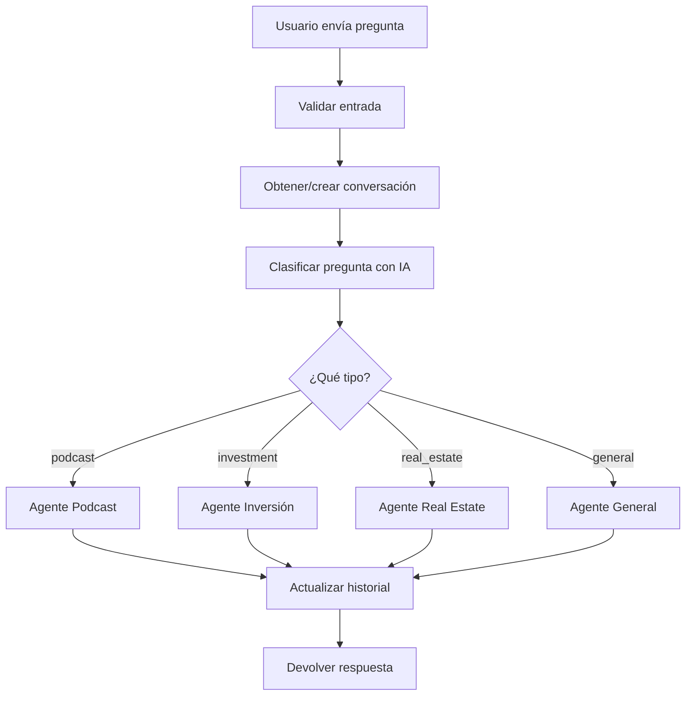

# 🚀 Oráculo de IA para itnig

Backend inteligente con agentes especializados para responder preguntas sobre itnig usando Vercel Serverless Functions y OpenAI. **Sistema de agentes expertos con clasificación automática y conversaciones con contexto.**

## 🎯 Características

- **Endpoint único**: `POST /api/query`
- **Clasificación automática** de preguntas usando IA
- **🆕 Sistema de conversaciones** - Mantiene memoria de la conversación
- **💰 Portfolio dinámico** - Se actualiza automáticamente desde el CSV
- **5 agentes especializados**:
  - 🎙️ **Podcast**: Usa API externa para búsqueda en episodios del podcast
  - 💰 **Investment**: Preguntas sobre fondo, portfolio, empresas participadas
  - 🏢 **Real Estate**: Preguntas sobre coworking, restaurante, espacios físicos
  - ℹ️ **General**: Preguntas generales sobre itnig (historia, evolución, modelo)
  - 🤖 **Clasificador**: Determina qué agente debe responder

## 🏗️ Arquitectura del Sistema

### Flujo de Funcionamiento


### Agentes Especializados

#### 🎙️ **Agente de Podcast**
- **API Externa**: `https://itnig-search-api-555158784456.europe-southwest1.run.app/search`
- **Funcionalidad**: Búsqueda semántica en episodios del podcast
- **Respuesta**: Clips relevantes con timestamps y thumbnails de YouTube
- **Datos**: `video_url`, `start_time`, `end_time`, `text`

#### 💰 **Agente de Inversión**
- **Base de Datos**: CSV `portfolio.csv` con empresas invertidas
- **Funcionalidad**: Información detallada sobre portfolio y empresas específicas
- **Datos**: Nombre, descripción, fundadores, estado, sector, etc.

#### 🏢 **Agente de Real Estate**
- **Funcionalidad**: Información sobre espacios físicos de itnig
- **Datos**: Coworking, restaurante Entrepreneur, ubicaciones, servicios

#### ℹ️ **Agente General**
- **Contexto**: Información completa de itnig desde `context.txt`
- **Funcionalidad**: Historia, evolución, modelo de negocio, éxitos
- **Datos**: Fundación (2010), empresas creadas, exits, espacios físicos

## 📊 Estructura del Portfolio

El sistema procesa automáticamente un archivo `portfolio.csv` con esta estructura:

```csv
Name,visibility,founders,short_description_en,long_description_en,Twitter,Linkedin,Website,Founded,Exit,focus,status,vehicle,quote,quote_by
```

**Campos principales:**
- `Name`: Nombre de la empresa
- `founders`: Fundadores
- `short_description_en`: Descripción breve
- `long_description_en`: Descripción detallada
- `focus`: Sector/industria
- `status`: active/exit/owned
- `vehicle`: Vehículo de inversión (IFO1, IFO2, etc.)
- `Founded`: Año de fundación
- `Exit`: Año de salida (si aplica)

## 🛠️ Instalación

### 1. Clonar el repositorio
```bash
git clone <tu-repositorio>
cd oracle
```

### 2. Instalar dependencias
```bash
npm install
```

### 3. Configurar variables de entorno
Crear un archivo `.env.local`:
```env
OPENAI_API_KEY=tu_api_key_de_openai
```

### 4. Añadir datos del portfolio
```bash
# Coloca tu archivo portfolio.csv en el directorio raíz
cp tu_portfolio.csv portfolio.csv
```

### 5. Desplegar en Vercel
```bash
# Instalar Vercel CLI si no lo tienes
npm i -g vercel

# Desplegar
vercel --prod
```

## 📡 Uso de la API

### Endpoint
```
POST /api/query
```

### Formato de entrada

#### Pregunta individual (sin contexto)
```json
{
  "question": "¿Qué es itnig?"
}
```

#### Pregunta con conversación (con contexto)
```json
{
  "question": "¿Cuánto invierte?",
  "conversationId": "mi-conversacion-123"
}
```

### Formato de salida
```json
{
  "response": "itnig es un ecosistema integral de startups fundado en Barcelona en 2010...",
  "classification": "general",
  "question": "¿Qué es itnig?",
  "conversationId": "mi-conversacion-123",
  "messageCount": 4,
  "podcasts": [/* Solo si es podcast */]
}
```

## 🗣️ Conversaciones con Contexto

### ¿Cómo funciona?

1. **Primera pregunta**: Envía `conversationId` para iniciar una conversación
2. **Preguntas siguientes**: Usa el mismo `conversationId` para mantener contexto
3. **Memoria automática**: La IA recuerda hasta 10 mensajes de la conversación
4. **Limpieza automática**: Las conversaciones se borran después de 30 minutos de inactividad

### Ejemplo de conversación

```bash
# Mensaje 1: Iniciar conversación
curl -X POST https://tu-dominio.vercel.app/api/query \
  -H "Content-Type: application/json" \
  -d '{
    "question": "¿Qué es itnig?",
    "conversationId": "conv-001"
  }'

# Respuesta: "itnig es un ecosistema integral de startups fundado en Barcelona en 2010..."

# Mensaje 2: Seguir conversación
curl -X POST https://tu-dominio.vercel.app/api/query \
  -H "Content-Type: application/json" \
  -d '{
    "question": "¿Cuánto invierte el fondo?",
    "conversationId": "conv-001"
  }'

# Respuesta: "El fondo de itnig invierte en startups tecnológicas..." (recuerda que hablábamos de itnig)

# Mensaje 3: Más contexto
curl -X POST https://tu-dominio.vercel.app/api/query \
  -H "Content-Type: application/json" \
  -d '{
    "question": "¿Y en qué empresas han invertido?",
    "conversationId": "conv-001"
  }'

# Respuesta: "itnig ha invertido en empresas como Factorial, Quipu, Camaloon..." (mantiene contexto completo)
```

## 🧪 Ejemplos de uso

### Ejemplo 1: Pregunta sobre podcast
```bash
curl -X POST https://tu-dominio.vercel.app/api/query \
  -H "Content-Type: application/json" \
  -d '{"question": "¿Qué episodios hablan sobre inversión?"}'
```

### Ejemplo 2: Conversación sobre portfolio
```bash
# Iniciar conversación
curl -X POST https://tu-dominio.vercel.app/api/query \
  -H "Content-Type: application/json" \
  -d '{
    "question": "Háblame de Factorial",
    "conversationId": "portfolio-chat"
  }'

# Seguir conversación
curl -X POST https://tu-dominio.vercel.app/api/query \
  -H "Content-Type: application/json" \
  -d '{
    "question": "¿En qué otros sectores invierten?",
    "conversationId": "portfolio-chat"
  }'
```

### Ejemplo 3: Pregunta sobre espacios físicos
```bash
curl -X POST https://tu-dominio.vercel.app/api/query \
  -H "Content-Type: application/json" \
  -d '{"question": "¿Tienen espacios de coworking disponibles?"}'
```

## 🔄 Actualizar Datos del Portfolio

Para añadir nuevas empresas o actualizar información existente:

1. **Actualizar el archivo CSV**
```bash
# Editar portfolio.csv con nuevos datos
nano portfolio.csv
```

2. **Redesplegar** (si usas Vercel)
```bash
vercel --prod
```

El sistema automáticamente:
- Procesa el CSV actualizado
- Hace la información disponible para consultas

## 🧪 Testing

### Probar la API
```bash
curl -X POST https://tu-dominio.vercel.app/api/query \
  -H "Content-Type: application/json" \
  -d '{"question": "¿En qué empresas invierte itnig?"}'
```

### Probar diferentes tipos de preguntas
```bash
# Podcast
curl -X POST https://tu-dominio.vercel.app/api/query \
  -H "Content-Type: application/json" \
  -d '{"question": "¿Qué episodios hablan sobre emprendimiento?"}'

# Inversión
curl -X POST https://tu-dominio.vercel.app/api/query \
  -H "Content-Type: application/json" \
  -d '{"question": "¿Qué empresas fintech están en el portfolio?"}'

# Real Estate
curl -X POST https://tu-dominio.vercel.app/api/query \
  -H "Content-Type: application/json" \
  -d '{"question": "¿Dónde está el coworking de itnig?"}'

# General
curl -X POST https://tu-dominio.vercel.app/api/query \
  -H "Content-Type: application/json" \
  -d '{"question": "¿Cuándo se fundó itnig?"}'
```

## 📝 Ejemplos de Consultas por Categoría

### 🎙️ Podcast
- "¿Qué episodios hablan sobre inversión?"
- "¿Quién ha sido el último invitado del podcast?"
- "¿Qué temas cubre el podcast de itnig?"
- "Háblame del episodio sobre Factorial"

### 💰 Portfolio de Inversiones
- "Háblame de Factorial"
- "¿Qué empresas fintech están en el portfolio?"
- "¿Quiénes son los fundadores de Quipu?"
- "¿Cuál es la estrategia de inversión de itnig?"
- "Muéstrame empresas exitadas"
- "¿En qué sectores invierte itnig?"

### 🏢 Real Estate
- "¿Tienen espacios de coworking disponibles?"
- "¿Dónde está el restaurante Entrepreneur?"
- "¿Puedo alquilar una oficina en itnig?"
- "¿Qué servicios ofrecen en el coworking?"
- "¿Dónde están ubicados los espacios de itnig?"

### ℹ️ General
- "¿Qué es itnig?"
- "¿Cuándo se fundó itnig?"
- "¿Cómo ha evolucionado itnig?"
- "¿Qué empresas ha creado itnig?"
- "¿Cuáles han sido los mayores éxitos de itnig?"
- "¿Quién fundó itnig?"

## 🔧 Configuración

### Variables de Entorno
- `OPENAI_API_KEY`: Tu API key de OpenAI (requerido)

### Configuración CSV
- El archivo debe llamarse `portfolio.csv`
- Debe estar en el directorio raíz
- Debe tener los headers de columnas esperados

### Configuración CORS
El sistema está configurado para permitir peticiones desde cualquier origen:
```javascript
res.setHeader('Access-Control-Allow-Origin', '*');
res.setHeader('Access-Control-Allow-Methods', 'GET, POST, PUT, DELETE, OPTIONS');
res.setHeader('Access-Control-Allow-Headers', 'Content-Type, Authorization, X-Requested-With');
```

## 📈 Rendimiento

- **Inicialización**: ~1-2 segundos para cargar datos del portfolio
- **Respuesta de consulta**: ~1-3 segundos para consultas típicas
- **Uso de memoria**: ~50-100MB dependiendo del tamaño del portfolio
- **Escalabilidad**: Soporta portfolios con cientos de empresas

## 🚀 Próximas Funcionalidades

### En Desarrollo
- **Agente de Postulaciones**: Sistema automatizado para startups que quieren postularse
- **Base de Datos Persistente**: Para guardar conversaciones y postulaciones
- **Sistema de Email**: Para enviar postulaciones a Marcel
- **Evaluación Automática**: IA que evalúa startups y genera recomendaciones

### Roadmap
- **Métricas y Analytics**: Dashboard para ver uso del oráculo
- **Integración con CRM**: Conectar con herramientas de gestión de leads
- **API de Webhooks**: Para notificaciones en tiempo real
- **Multiidioma**: Soporte para catalán e inglés

## 🤝 Contribuir

1. Fork el repositorio
2. Crea una rama de feature
3. Haz tus cambios
4. Prueba con diferentes tipos de consultas
5. Envía un pull request

## 📄 Licencia

MIT License - ver archivo LICENSE para detalles

## 🆘 Soporte

Para problemas o preguntas:
1. Revisa los logs en el dashboard de Vercel
2. Verifica el formato de tu archivo CSV
3. Asegúrate de que tu API key de OpenAI sea válida
4. Prueba con diferentes tipos de consultas

---

**Construido con ❤️ para itnig** 